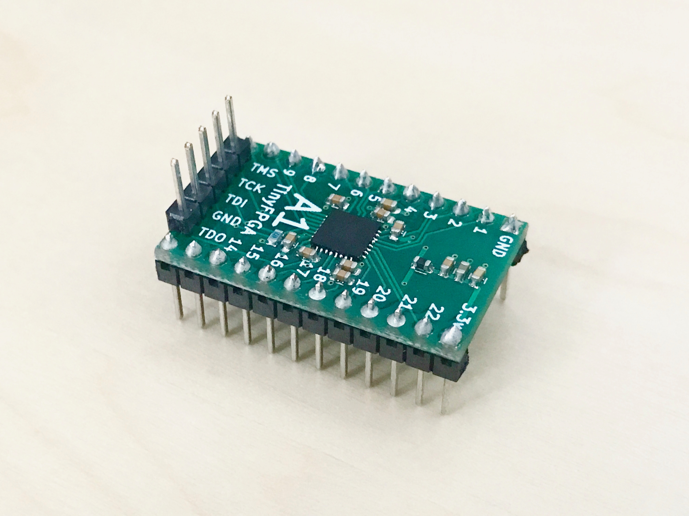
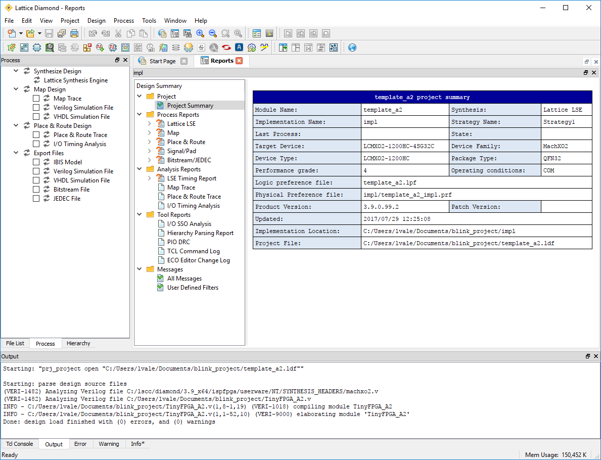
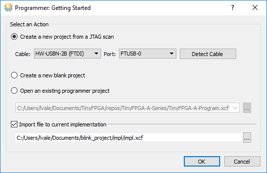
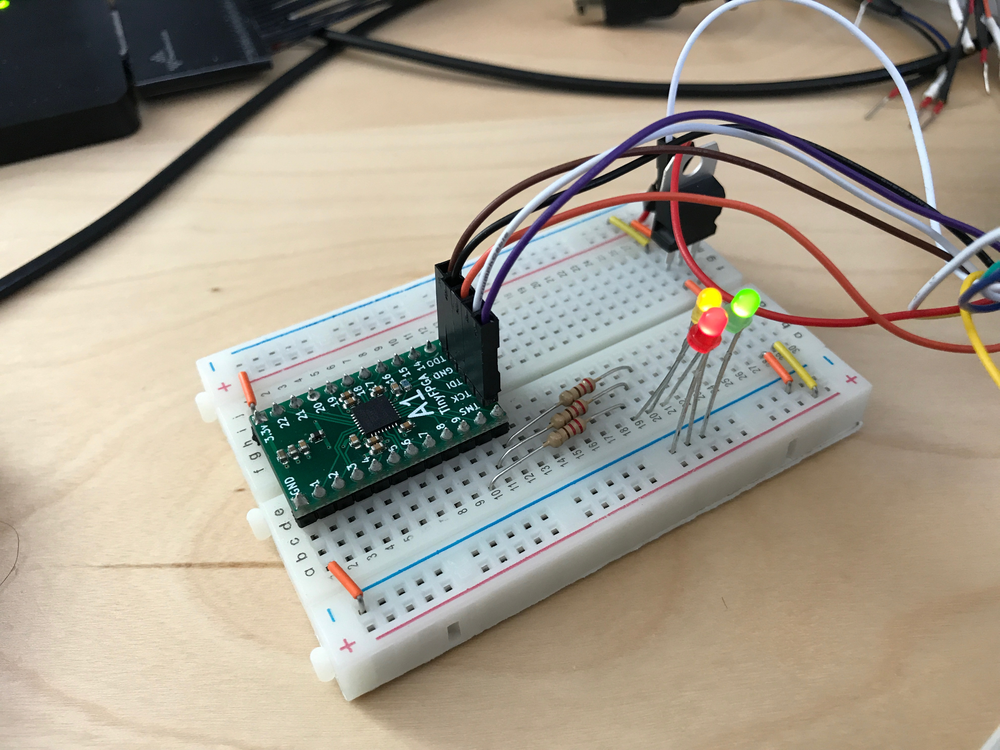

## Getting Started
The TinyFPGA A-Series boards use Lattice Semiconductor's MachXO2 FPGAs.  There are a number of existing software and hardware tools available as well as documentation from Lattice for these FPGAs.  This guide will help get you started with the A-Series boards and the tools and information specific to them as well as the tools and documentation available for the FPGA chips themselves.

### Hardware
Of course you will need to purchase one or more A-Series boards, but you will also need a few other things to get working.

1. TinyFPGA [A1](http://store.tinyfpga.com/product/tinyfpga-a1) or [A2](http://store.tinyfpga.com/product/tinyfpga-a2) Board.
2. [Pins](http://store.tinyfpga.com/product/a-series-pins) if you want to solder the board to another PCB, insert it into a socket, or use with a solderless breadboard.
3. 3.3 volt power supply.  You can use a [3.3 volt regulator](http://store.tinyfpga.com/product/a-series-3-3-volt-regulator-ld1117v33), a lab power supply, or use an existing 3.3 volt power supply from your project.
4. [JTAG programmer](https://www.ebay.com/sch/i.html?_nkw=lattice+fpga+jtag).  TinyFPGA currently doesn't have a JTAG programmer, but I hope to soon have an opensource Arduino sketch available soon and very low-cost programmer hardware later.
5. [Something](https://www.google.com/search?q=godzilla+robot&safe=active&tbm=isch) [interesting](https://www.google.com/search?q=quad+copter&safe=active&tbm=isch) [to](https://www.google.com/search?q=3d+printer+open+source&safe=active&tbm=isch) [control](https://www.google.com/search?q=vga+graphics&safe=active&tbm=isch) [or](https://www.google.com/search?q=retro+console&safe=active&tbm=isch) [interface](https://www.google.com/search?q=retro+computer&safe=active&tbm=isch) [with](https://www.google.com/search?q=tcp+ip&safe=active&tbm=isch).  If you are just starting out you could use some LEDs or maybe a logic analyzer.  Otherwise you might have something more specific in mind ;)

### Software
You will need to install the latest development environment and other support tools for the MachXO2 FPGAs and the A-Series boards.

1. Download and install [Lattice Diamond](http://www.latticesemi.com/latticediamond).  It is available for both [Windows](http://www.latticesemi.com/latticediamond#windows) and [Linux](http://www.latticesemi.com/latticediamond#linux).
2. [Request a free license file](http://www.latticesemi.com/Support/Licensing/DiamondAndiCEcube2SoftwareLicensing/DiamondFree.aspx) in order to use the [Lattice Diamond](http://www.latticesemi.com/latticediamond) software.
3. The TinyFPGA A-Series GitHub Repository has Lattice Diamond template projects that you may find useful.  They include an empty top-level verilog module with pin constraints to map board pins to the correct IOs on the MachXO2 FPGA chip.  You could [download the latest files directly in a zip file](https://github.com/tinyfpga/TinyFPGA-A-Series/archive/master.zip) or [clone the repo using git](https://github.com/tinyfpga/TinyFPGA-A-Series.git).

### First Project Tutorial

Once you have all of your hardware and software ready you can get started developing some digital logic.  This first project won't go into all the details of designing and implementing digital logic circuits in general, but it will guide you through the specifics of setting up a simple project, writing verilog, generating a bitstream for your TinyFPGA A1 or A2 board, and programming your board with the bitstream. 

#### 1. Solder Pins to your board

This tutorial will use the TinyFPGA board in a breadboard.  If you want to follow along you will need to solder pins to the board for it to drive the LEDs and to provide a connection for the JTAG programmer.


The JTAG pins are on the board twice.  There is a header at the bottom of the board where the pins can be soldered on facing up.  This is most convenient if you want to connect your JTAG programmer directly to the board.  The JTAG pins are also on the right side of the board.  This is useful if you are taking advantage of the `JTAGENB` feature and want to use the JTAG pins for IO.  They are also useful if you want to add the TinyFPGA board to an existing JTAG chain in your project.



#### 2. Build LED blinker circuit

Now that your board has pins on it it can be inserted into a solderless breadboard.  In my breadboard I am using a [3.3 volt regulator](http://store.tinyfpga.com/product/a-series-3-3-volt-regulator-ld1117v33) to convert a 5 volt power source.  I connected LEDs to pins 9, 10, and 11 with 220 ohm resistors in series.


#### 3. Connect JTAG programmer

I had bought the [official Lattice Programming Cable](http://www.mouser.com/search/ProductDetail.aspx?R=0virtualkey0virtualkeyHW-USBN-2B) for too much money.  I think the [generic lattice programming cables on eBay]((https://www.ebay.com/sch/i.html?_nkw=lattice+fpga+jtag)) are more than good enough.  They use the same FTDI chip.  The colors in my setup might not match the colors on your cable.  Pay attention to the JTAG names on the FPGA board and connect them to the correct wires on your programming cable.  

In my circuit I'm using the `5V Out` from the programming cable to drive the 3.3 volt regulator.  Make sure you connect the `VCC` wire from the programmer to 3.3 volts on your board.  That's the voltage level the programmer will use when communicating with the FPGA. 


#### 4. Copy the template project from the [TinyFPGA A-Series Repository](https://github.com/tinyfpga/TinyFPGA-A-Series/archive/master.zip)

Copy either the [`template_a1`](https://github.com/tinyfpga/TinyFPGA-A-Series/tree/master/template_a1) or [`template_a2`](https://github.com/tinyfpga/TinyFPGA-A-Series/tree/master/template_a2) directories to a new directory and rename it `blink_project`.

#### 5. Open your newly copied template project

Open the Lattice Diamond application.  From the `File` menu select `Open` and `Project...`.  In the newly opened file chooser, navigate to the `blink_project` directory you just created and select the `template_a1.ldf` or `template_a2.ldf` project file.


#### 6. Implement your logic

Now that we have opened our new project we can write some verilog code.  Make sure the `File List` tab is open on the left-hand side view and open up the `TinyFPGA_A1.v` or `TinyFPGA_A2.v` verilog file.


This is a very simple top-level verilog module that represents the IO pins available on the TinyFPGA A-Series boards.  Right now this top-level is assigning all the pins to `1'bz`.  This means the pins will be left floating or disconnected.  Let's implement some logic to blink a few LEDs.

Before we can do anything, we need a clock source.  The MachXO2 FPGAs have an internal oscillator we can use.  To use the internal oscillator we need to instantiate the `OSCH` module and tell it what frequency we want.

```verilog
  wire clk;
  
  OSCH #(
    .NOM_FREQ("2.08")
  ) internal_oscillator_inst (
    .STDBY(1'b0), 
    .OSC(clk)
  ); 
```

Since we are just blinking some LEDs we don't need a high frequency so we can use the lowest internal frequency available which is 2.08 MHz.  For more details on the clock resources available in the MachXO2 FPGAs please see the [MachXO2 sysCLOCK PLL Design and Usage Guide](http://www.latticesemi.com/~/media/LatticeSemi/Documents/ApplicationNotes/MO/MachXO2sysCLOCKPLLDesignandUsageGuide.pdf?document_id=39080).

_NOTE: If you are familiar with VHDL or Verilog you may decide to quickly skim through the rest of this step or skip it completely.  If you are not at all familiar with Verilog you should pay close attention and take a look at the additional resources at the end of this tutorial._

Now that we have a clock we can implement some sequential logic.  We will create a simple counter to time the blinking of our LEDs.

```verilog
  reg [23:0] led_timer;
  
  always @(posedge clk) begin
    led_timer <= led_timer + 1; 
  end
```

The timer will increment by 1 every clock period.  We can use the upper bits to blink our LEDs but we need to assign them to external pins.  Edit the corresponding `assign` statements so they match the code below.

```verilog
  assign pin9_jtgnb = led_timer[23];
  assign pin10_sda = led_timer[22];
  assign pin11_scl = led_timer[21];
```

At this point you should save all your changes by clicking the floppy disk icon below the menubar or by using the `CTRL + SHIFT + S` keyboard shortcut.  

#### 7. Generate JEDEC programming file

Select the `Process` tab on the left hand side view.  This will bring up a tree of tasks that need to be executed in order to generate the JEDEC programming file.  At the very bottom of the tree you should see an entry labeled `JEDEC File`.  Double-click that entry and the programming file should be created.  When it is done it will have a green checkmark next to it.



#### 8. Program the FPGA board

From the `Tools` menu select `Programmer`.  

In the `Programmer: Getting Started` dialog make sure the `Create a new project from a JTAG scan` option is selected as well as the `Import file to current implementation` checkbox.



Click on the program button to program the design onto the FPGA.


#### 9. Verify the design works on the board as intended

If you followed this tutorial exactly you should see the three LEDs counting in binary.  One will stay on for about a second, then off for a second.  The next will be on for two seconds and off for two seconds.  The last will be on for four seconds and off for four seconds.

If you see the LEDs blinking congratulations!  You've successfully programmed your FPGA board.  If you are familiar with Verilog and digital design you are ready to implement more complicated designs on your board(s).



### Extra Resources
* [TinyFPGA A-Series Repository](https://github.com/tinyfpga/TinyFPGA-A-Series)
* Generic FPGA and Verilog Tutorials
  * [http://www.fpga4fun.com/](http://www.fpga4fun.com/)
  * [Digital Logic Tutorial](http://www.asic-world.com/digital/tutorial.html)
  * [Verilog Tutorial](http://www.asic-world.com/verilog/veritut.html)
* [Lattice MachXO2 Page](http://www.latticesemi.com/Products/FPGAandCPLD/MachXO2.aspx#_3D24D0EEB97F430890D7AF24D20DF79A)
  * [MachXO2 Family Data Sheet](http://www.latticesemi.com/view_document?document_id=38834)
  * [MachXO2 sysIO Usage Guide](http://www.latticesemi.com/view_document?document_id=39083)
  * [MachXO2 sysCLOCK PLL Design and Usage Guide](http://www.latticesemi.com/~/media/LatticeSemi/Documents/ApplicationNotes/MO/MachXO2sysCLOCKPLLDesignandUsageGuide.pdf?document_id=39080)
  * [Memory Usage Guide for MachXO2 Devices](http://www.latticesemi.com/view_document?document_id=39082)
  * [Implementing High-Speed Interfaces with MachXO2 Devices](http://www.latticesemi.com/view_document?document_id=39084)
