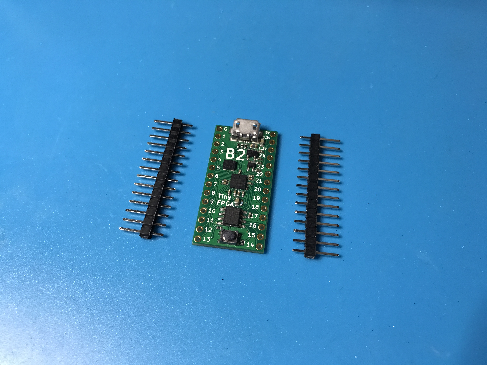
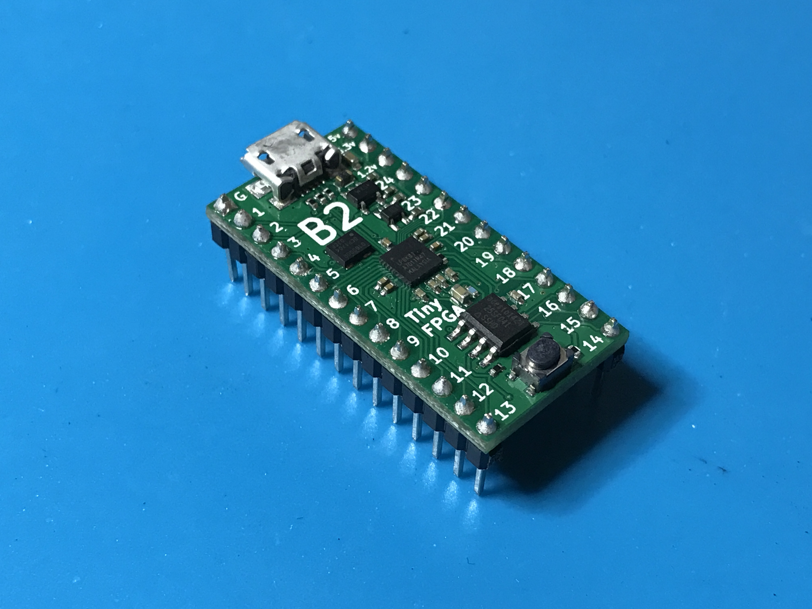

## Getting Started
The TinyFPGA B-Series boards use Lattice Semiconductor's iCE40 FPGAs.  There are a number of existing software and hardware tools available as well as documentation from Lattice for these FPGAs.  This guide will help get you started with the B-Series boards and the tools and information specific to them as well as the tools and documentation available for the FPGA chips themselves.

### Hardware
Of course you will need to purchase one or more B-Series boards, but you will also need a few other things to get working.

1. TinyFPGA [B2](http://store.tinyfpga.com/product/tinyfpga-B2) Board (the B1 board is not yet available).
2. [Pins](http://store.tinyfpga.com/product/b-series-pins) if you want to solder the board to another PCB, insert it into a socket, or use with a solderless breadboard.
3. [Something](https://www.google.com/search?q=godzilla+robot&safe=active&tbm=isch) [interesting](https://www.google.com/search?q=quad+copter&safe=active&tbm=isch) [to](https://www.google.com/search?q=3d+printer+open+source&safe=active&tbm=isch) [control](https://www.google.com/search?q=vga+graphics&safe=active&tbm=isch) [or](https://www.google.com/search?q=retro+console&safe=active&tbm=isch) [interface](https://www.google.com/search?q=retro+computer&safe=active&tbm=isch) [with](https://www.google.com/search?q=tcp+ip&safe=active&tbm=isch).  If you are just starting out you could use some LEDs or maybe a logic analyzer.  Otherwise you might have something more specific in mind ;)

### Software
You will need to install the latest development environment and other support tools for the iCE40 FPGAs and the B-Series boards.

1. Download and install [Lattice iCEcube2](http://www.latticesemi.com/iCEcube2).  It is available for both Windows and Linux.
2. [Request a free license file](http://www.latticesemi.com/Support/Licensing/DiamondAndiCEcube2SoftwareLicensing/DiamondFree.aspx) in order to use the [Lattice iCEcube2](http://www.latticesemi.com/iCEcube2) software.
3. The TinyFPGA B-Series GitHub Repository has Lattice iCEcube2 template projects that you may find useful.  They include an empty top-level verilog module with pin constraints to map board pins to the correct IOs on the iCE40 FPGA chip.  You could [download the latest files directly in a zip file](https://github.com/tinyfpga/TinyFPGA-B-Series/archive/master.zip) or [clone the repo using git](https://github.com/tinyfpga/TinyFPGA-B-Series.git).

### First Project Tutorial

Once you have all of your hardware and software ready you can get started developing some digital logic.  This first project won't go into all the details of designing and implementing digital logic circuits in general, but it will guide you through the specifics of setting up a simple project, writing verilog, generating a bitstream for your TinyFPGA B1 or B2 board, and programming your board with the bitstream. 

#### 1. Solder Pins to your board

This tutorial will use the TinyFPGA board in a breadboard.  If you want to follow along you will need to solder pins to the board for it to drive the LEDs.





#### 2. Build LED blinker circuit

Now that your board has pins on it it can be inserted into a solderless breadboard.  In my breadboard I am using the built-in micro USB port to provide power.  I connected LEDs to pins 11, 12, and 13 with 220 ohm resistors in series.


#### 3. Connect USB cable

Connect a micro USB cable to the TinyFPGA board.  Use a quality cable to minimize programming issues.


#### 4. Copy the template project from the [TinyFPGA B-Series Repository](https://github.com/tinyfpga/TinyFPGA-B-Series/archive/master.zip)

Copy the [`template`](https://github.com/tinyfpga/TinyFPGA-B-Series/tree/master/template) directory to a new directory and rename it `blink_project`.

#### 5. Open your newly copied template project

Open the Lattice iCEcube2 application.  From the `File` menu select `Open` and `Project...`.  In the newly opened file chooser, navigate to the `blink_project` directory you just created and select the `template.ldf` project file.


#### 6. Implement your logic

Now that we have opened our new project we can write some verilog code.  Make sure the `File List` tab is open on the left-hand side view and open up the `TinyFPGA_B.v` verilog file.


This is a very simple top-level verilog module that represents the IO pins available on the TinyFPGA B-Series boards.  Right now this top-level is assigning all the pins to `1'bz`.  This means the pins will be left floating or disconnected.  Let's implement some logic to blink a few LEDs.

Before we can do anything, we need a clock source.  The TinyFPGA B-Series boards have an on-board 16MHz clock we can use.  This clock is available on pin 3.  We can also use the internal PLL to generate a new clock frequency.

```verilog
  wire clk;
  
  OSCH #(
    .NOM_FREQ("2.08")
  ) internal_oscillator_inst (
    .STDBY(1'b0), 
    .OSC(clk)
  ); 
```

We don't need a high frequency to blink some LEDs, but there are limits to how slow the PLL can operate.  Further reduction of the clock frequency can be achieved in the digital logic.

_NOTE: If you are familiar with VHDL or Verilog you may decide to quickly skim through the rest of this step or skip it completely.  If you are not at all familiar with Verilog you should pay close attention and take a look at the additional resources at the end of this tutorial._

Now that we have a clock we can implement some sequential logic.  We will create a simple counter to time the blinking of our LEDs.

```verilog
  reg [23:0] led_timer;
  
  always @(posedge clk) begin
    led_timer <= led_timer + 1; 
  end
```

The timer will increment by 1 every clock period.  We can use the upper bits to blink our LEDs but we need to assign them to external pins.  Edit the corresponding `assign` statements so they match the code below.

```verilog
  assign pin11 = led_timer[23];
  assign pin12 = led_timer[22];
  assign pin13 = led_timer[21];
```

At this point you should save all your changes by clicking the floppy disk icon below the menubar or by using the `CTRL + SHIFT + S` keyboard shortcut.  

#### 7. Generate a hex programming file

Select the `Process` tab on the left hand side view.  This will bring up a tree of tasks that need to be executed in order to generate the JEDEC programming file.  At the very bottom of the tree you should see an entry labeled `JEDEC File`.  Double-click that entry and the programming file should be created.  When it is done it will have a green checkmark next to it.


#### 8. Program the FPGA board

From the `Tools` menu select `Programmer`.  

In the `Programmer: Getting Started` dialog make sure the `Create a new project from a JTAG scan` option is selected as well as the `Import file to current implementation` checkbox.


Click on the program button to program the design onto the FPGA.


#### 9. Verify the design works on the board as intended

If you followed this tutorial exactly you should see the three LEDs counting in binary.  One will stay on for about a second, then off for a second.  The next will be on for two seconds and off for two seconds.  The last will be on for four seconds and off for four seconds.

If you see the LEDs blinking congratulations!  You've successfully programmed your FPGA board.  If you are familiar with Verilog and digital design you are ready to implement more complicated designs on your board(s).


### Extra Resources
* [TinyFPGA B-Series Repository](https://github.com/tinyfpga/TinyFPGA-B-Series)
* [TinyFPGA B-Series Project on Hackaday.io](https://hackaday.io/project/26848-tinyfpga-b-series)
* Generic FPGA and Verilog Tutorials
  * [http://www.fpga4fun.com/](http://www.fpga4fun.com/)
  * [Digital Logic Tutorial](http://www.asic-world.com/digital/tutorial.html)
  * [Verilog Tutorial](http://www.asic-world.com/verilog/veritut.html)
* [Lattice iCE40 Page](http://www.latticesemi.com/Products/FPGAandCPLD/iCE40.aspx)
  * [iCE40 LP/HX Family Data Sheet](http://www.latticesemi.com/view_document?document_id=49312)
  * [iCE40 sysCLOCK PLL Design and Usage Guide](http://www.latticesemi.com/view_document?document_id=47778)
  * [Memory Usage Guide for iCE40 Devices](http://www.latticesemi.com/view_document?document_id=47775)
