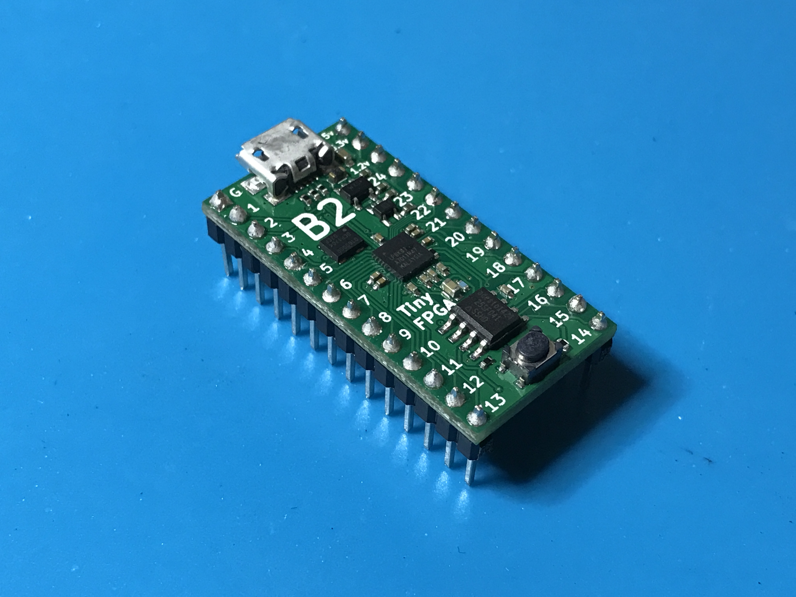
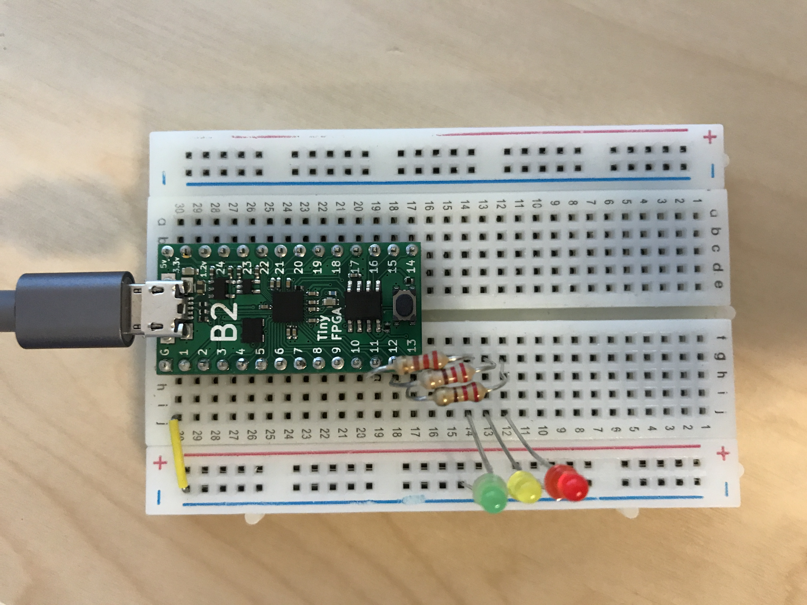
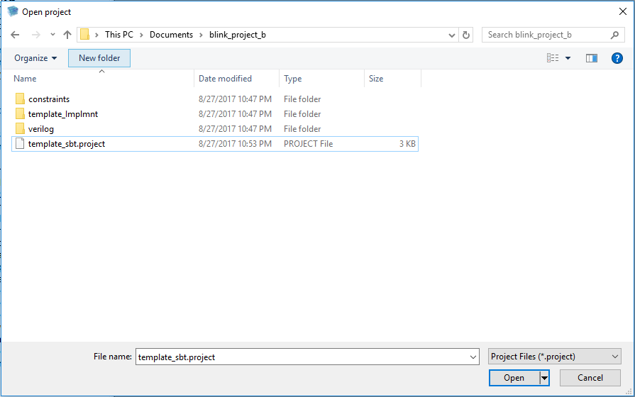
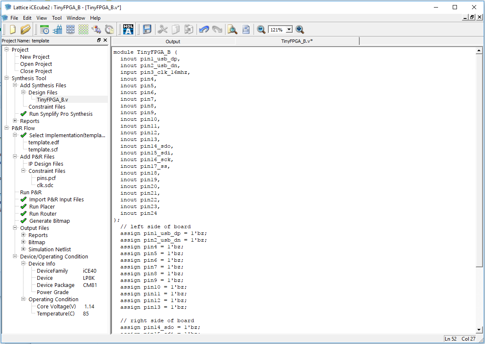
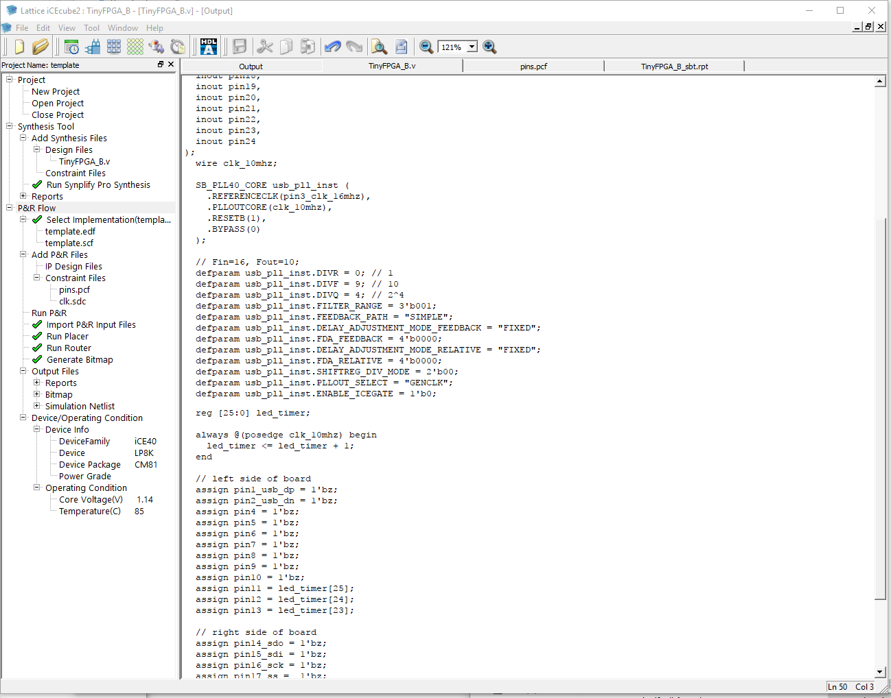
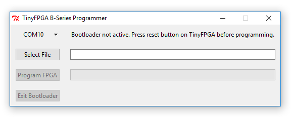
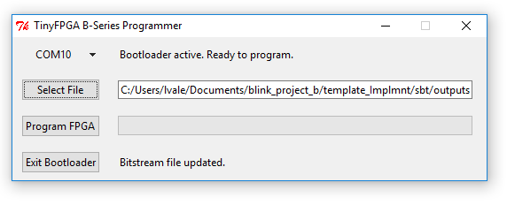
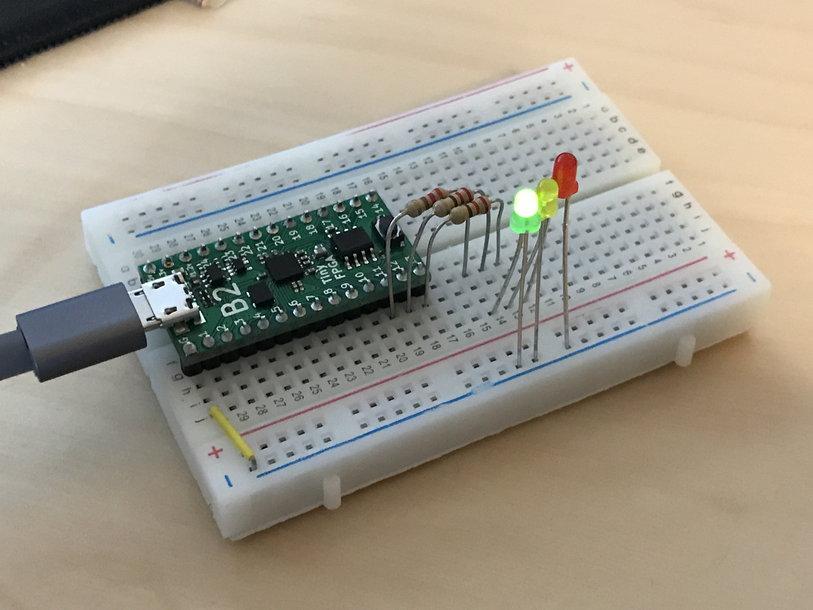

## Getting Started

The TinyFPGA B-Series boards use Lattice Semiconductor's iCE40 FPGAs.  There are a number of existing software and hardware tools available as well as documentation from Lattice for these FPGAs.  This guide will help get you started with the B-Series boards and the tools and information specific to them as well as the tools and documentation available for the FPGA chips themselves.

### Hardware

Of course you will need to purchase one or more B-Series boards, but you will also need a few other things to get working.

1. TinyFPGA [B2](http://store.tinyfpga.com/products/tinyfpga-B2) Board.
2. Pins if you want to solder the board to another PCB, insert it into a socket, or use with a solderless breadboard.
3. [Something](https://www.google.com/search?q=godzilla+robot&safe=active&tbm=isch) [interesting](https://www.google.com/search?q=quad+copter&safe=active&tbm=isch) [to](https://www.google.com/search?q=3d+printer+open+source&safe=active&tbm=isch) [control](https://www.google.com/search?q=vga+graphics&safe=active&tbm=isch) [or](https://www.google.com/search?q=retro+console&safe=active&tbm=isch) [interface](https://www.google.com/search?q=retro+computer&safe=active&tbm=isch) [with](https://www.google.com/search?q=tcp+ip&safe=active&tbm=isch).  If you are just starting out you could use some LEDs or maybe a logic analyzer.  Otherwise you might have something more specific in mind ;)

### Software

You will need to install the latest development environment and other support tools for the iCE40 FPGAs and the B-Series boards.

1. Download and install [Lattice iCEcube2](http://www.latticesemi.com/iCEcube2).  It is available for both Windows and Linux.
2. [Request a free license file](http://www.latticesemi.com/Support/Licensing/DiamondAndiCEcube2SoftwareLicensing/DiamondFree.aspx) in order to use the [Lattice iCEcube2](http://www.latticesemi.com/iCEcube2) software.  Lattice has [detailed instructions on requesting a free license](http://www.latticesemi.com/en/Support/AnswerDatabase/3/9/2/3925.aspx) if you need some help.
3. Download and install the latest [TinyFPGA Programmer](https://github.com/tinyfpga/TinyFPGA-Programmer-Application/releases) release.  This application is written in Python but has a Windows installer.  If you have Python already installed on Windows, make sure you unselect `Install Python` on the installer.  For Linux, MacOS, and other posix operating systems, make sure you have Python 2.7 and run the [`tinyfpgab.py`](https://github.com/tinyfpga/TinyFPGA-B-Series/tree/master/programmer) Python script.  
4. The TinyFPGA B-Series GitHub Repository has Lattice iCEcube2 template projects that you may find useful.  They include an empty top-level verilog module with pin constraints to map board pins to the correct IOs on the iCE40 FPGA chip.  You could [download the latest files directly in a zip file](https://github.com/tinyfpga/TinyFPGA-B-Series/archive/master.zip) or [clone the repo using git](https://github.com/tinyfpga/TinyFPGA-B-Series.git).

### Serial Port Driver

**IMPORTANT:** If you are using a Windows version older than Windows 10, you need to install a universial USB serial port INF that tells Windows to use the USB serial port driver for the TinyFPGA B-Series boards.  Paul Stoffregen, the creator of the [Teensy](https://www.pjrc.com/teensy/) series of microcontroller boards has an installer that works very well for this.

Download and run the [Virtual Serial Driver Installer](https://www.pjrc.com/teensy/serial_install.exe).

### First Project Tutorial

Once you have all of your hardware and software ready you can get started developing some digital logic.  This first project won't go into all the details of designing and implementing digital logic circuits in general, but it will guide you through the specifics of setting up a simple project, writing verilog, generating a bitstream for your TinyFPGA B1 or B2 board, and programming your board with the bitstream. 

#### 1. Solder Pins to your board

This tutorial will use the TinyFPGA board in a breadboard.  If you want to follow along you will need to solder pins to the board for it to drive the LEDs.




#### 2. Build LED blinker circuit

Now that your board has pins on it it can be inserted into a solderless breadboard.  In my breadboard I am using the built-in micro USB port to provide power.  I connected LEDs to pins 11, 12, and 13 with 220 ohm resistors in series.



#### 3. Connect USB cable

Connect a micro USB cable to the TinyFPGA board.  Use a quality cable to minimize programming issues.

**REMINDER:** If you use a version of Windows older than Windows 10, download and run the [Virtual Serial Driver Installer](https://www.pjrc.com/teensy/serial_install.exe).

#### 4. Copy the template project from the [TinyFPGA B-Series Repository](https://github.com/tinyfpga/TinyFPGA-B-Series/archive/master.zip)

Copy the [`icecube2_template`](https://github.com/tinyfpga/TinyFPGA-B-Series/tree/master/icecube2_template) directory to a new directory and rename it `blink_project_b`.

#### 5. Open your newly copied template project

Open the Lattice iCEcube2 application.  From the `File` menu select `Open` and `Project...`.  In the newly opened file chooser, navigate to the `blink_project_b` directory you just created and select the `template_sbt.project` project file.



#### 6. Implement your logic

Now that we have opened our new project we can write some verilog code.  On the left side of the iCEcube2 user interface is a tree of files and processes representing the project.  Under `Synthesis Tool/Add Synthesis Files/Design Files`, select the `TinyFPGA_B.v` verilog file.



This is a very simple top-level verilog module that represents the IO pins available on the TinyFPGA B-Series boards.  Right now this top-level is assigning all the pins to `1'bz`.  This means the pins will be left floating or disconnected.  Let's implement some logic to blink a few LEDs.

Before we can do anything, we need a clock source.  The TinyFPGA B-Series boards have an on-board 16MHz clock we can use.  This clock is available on pin 3.  We can also use the internal PLL to generate a new clock frequency.

```verilog
  wire clk_10mhz;

  SB_PLL40_CORE usb_pll_inst (
    .REFERENCECLK(pin3_clk_16mhz),
    .PLLOUTCORE(clk_10mhz),
    .RESETB(1),
    .BYPASS(0)
  );

  // Fin=16, Fout=10;
  defparam usb_pll_inst.DIVR = 0; 
  defparam usb_pll_inst.DIVF = 9; 
  defparam usb_pll_inst.DIVQ = 4;
  defparam usb_pll_inst.FILTER_RANGE = 3'b001;
  defparam usb_pll_inst.FEEDBACK_PATH = "SIMPLE";
  defparam usb_pll_inst.DELAY_ADJUSTMENT_MODE_FEEDBACK = "FIXED";
  defparam usb_pll_inst.FDA_FEEDBACK = 4'b0000;
  defparam usb_pll_inst.DELAY_ADJUSTMENT_MODE_RELATIVE = "FIXED";
  defparam usb_pll_inst.FDA_RELATIVE = 4'b0000;
  defparam usb_pll_inst.SHIFTREG_DIV_MODE = 2'b00;
  defparam usb_pll_inst.PLLOUT_SELECT = "GENCLK";
  defparam usb_pll_inst.ENABLE_ICEGATE = 1'b0;
```

We don't need a high frequency to blink some LEDs, but there are limits to how slow the PLL can operate.  Further reduction of the clock frequency can be achieved in the digital logic.  PLLs can be complicated to program correctly.  It is highly recommended that you read and understand the [iCE40 sysCLOCK PLL Design and Usage Guide](http://www.latticesemi.com/view_document?document_id=47778).  Until you get around to reading that document, the following formula is most important: 


_NOTE: If you are familiar with VHDL or Verilog you may decide to quickly skim through the rest of this step or skip it completely.  If you are not at all familiar with Verilog you should pay close attention and take a look at the additional resources at the end of this tutorial._

Now that we have a clock we can implement some sequential logic.  We will create a simple counter to time the blinking of our LEDs.

```verilog
  reg [25:0] led_timer;
  
  always @(posedge clk_10mhz) begin
    led_timer <= led_timer + 1; 
  end
```

The timer will increment by 1 every clock period.  We can use the upper bits to blink our LEDs but we need to assign them to external pins.  Edit the corresponding `assign` statements so they match the code below.

```verilog
  assign pin11 = led_timer[25];
  assign pin12 = led_timer[24];
  assign pin13 = led_timer[23];
```

At this point you should save all your changes by clicking the floppy disk icon below the menubar or by using the `CTRL + S` keyboard shortcut.  

**TIP:** The mapping of TinyFPGA B-series board pin names to the FPGA pin names can be found in the [constraints/pins.pcf](https://github.com/tinyfpga/TinyFPGA-B-Series/blob/master/icecube2_template/constraints/pins.pcf) file.

#### 7. Generate a programming file

Go to the `Tool` file menu and select `Run All` to synthesize the design and generate a bitstream.  When synthesis is complete you should see a green checkmark next to the `Generate Bitmap` process.



#### 8. Program the FPGA board

* In Windows, open the 'TinyFPGA Programmer' application via the start menu.
* In MacOS and Linux, open the `TinyFPGA Programmer` application by running the `tinyfpgab-programmer.py` python module from the [TinyFPGA Programmer Application GitHub Repo](https://github.com/tinyfpga/TinyFPGA-Programmer-Application/releases/).

The bootloader on the B-Series boards will present itself as a serial port.  The programmer application will display serial port identifiers for each TinyFPGA board it can program.

When you first connect a B-Series board it may not be immediately ready to program.



If this happens you can press the reset button on the B-Series board to active the bootloader bitstream.  Once the bootloader is active the programmer application status will update.


Select the bitstream to program.  This will be buried a few directories under the project: `template_Implmnt/sbt/outputs/bitmap/TinyFPGA_B_bitmap.hex`

If you're using IceStorm for synthesis the bitstream will be a `.bin` file in the same directory as your project:
`icestorm_template/TinyFPGA_B.bin`



Press the `Program FPGA` button to program the bitstream to the user area of the FPGA board SPI flash.  The programmer application will keep you updated with the status.  If it fails, press the reset button and try again.  If the application becomes unresponsive, close the application, unplug the FPGA board, and start over.  If you have trouble programming your TinyFPGA B-Series board please contact me for help at luke@tinyfpga.com.

The programmer application will verify the bitstream was written correctly and report 'Success!' if all is well.  The programmer should also report that the bootloader is not active.  This is because the bootloader does not consume any FPGA resources while the user configuration is running.  The bootloader can be enabled again by pressing the reset button on the TinyFPGA board.


#### 9. Verify the design works on the board as intended

If you followed this tutorial exactly you should see the three LEDs counting in binary.  One will stay on for about a second, then off for a second.  The next will be on for two seconds and off for two seconds.  The last will be on for four seconds and off for four seconds.

If you see the LEDs blinking congratulations!  You've successfully programmed your FPGA board.  If you are familiar with Verilog and digital design you are ready to implement more complicated designs on your board(s).



### Extra Resources
* [TinyFPGA B-Series Repository](https://github.com/tinyfpga/TinyFPGA-B-Series)
* [TinyFPGA B-Series Project on Hackaday.io](https://hackaday.io/project/26848-tinyfpga-b-series)
* Generic FPGA and Verilog Tutorials
  * [http://www.fpga4fun.com/](http://www.fpga4fun.com/)
  * [Digital Logic Tutorial](http://www.asic-world.com/digital/tutorial.html)
  * [Verilog Tutorial](http://www.asic-world.com/verilog/veritut.html)
* [Lattice iCE40 Page](http://www.latticesemi.com/Products/FPGAandCPLD/iCE40.aspx)
  * [iCE40 LP/HX Family Data Sheet](http://www.latticesemi.com/view_document?document_id=49312)
  * [iCE40 sysCLOCK PLL Design and Usage Guide](http://www.latticesemi.com/view_document?document_id=47778)
  * [Memory Usage Guide for iCE40 Devices](http://www.latticesemi.com/view_document?document_id=47775)
