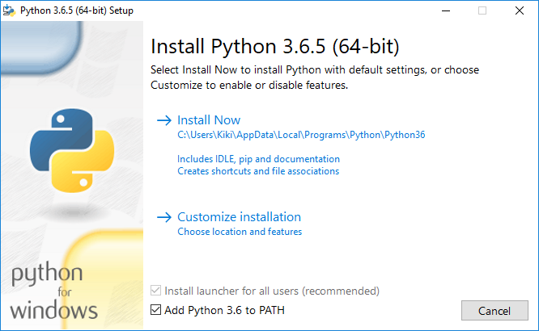
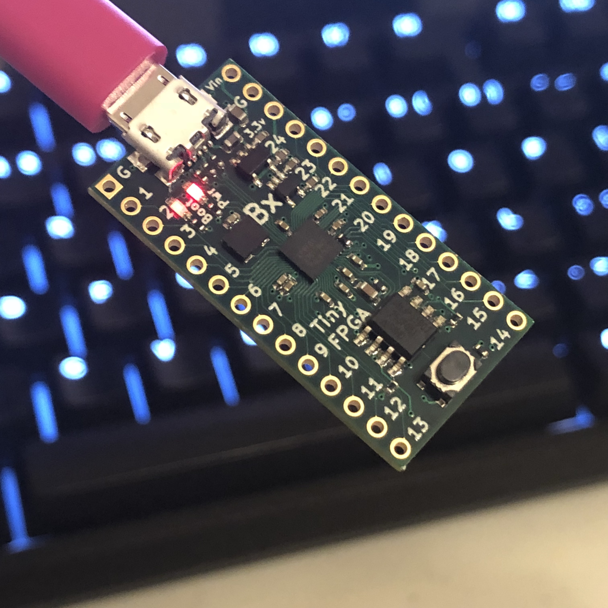
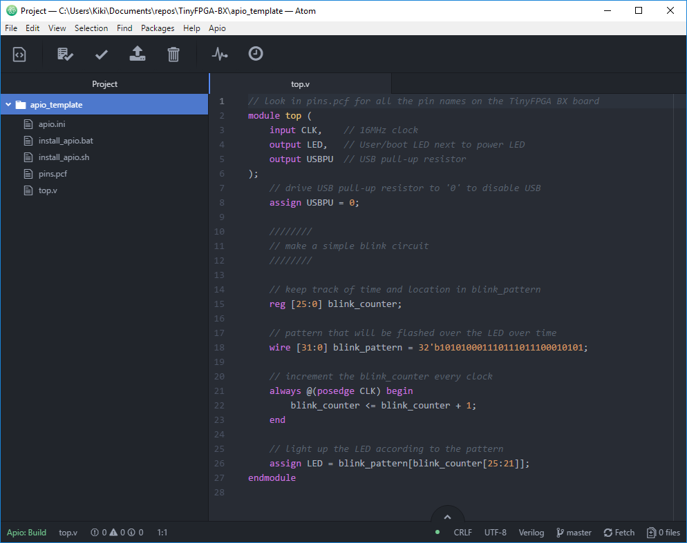

## Getting Started
The TinyFPGA BX boards use Lattice Semiconductor's iCE40 FPGAs.  There are a number of existing software and hardware tools available as well as documentation from Lattice for these FPGAs.  This guide will help get you started with the BX board, the tools, and documentation available for the FPGA chips themselves.

## Hardware
For this guide you will need a [TinyFPGA BX](https://www.crowdsupply.com/tinyfpga/tinyfpga-bx) board and a micro USB cable.

## Software
You will need to install the latest development environment and other support tools for the iCE40 FPGAs and the BX board.  The TinyFPGA BX is supported by open source tools.  These instructions should work for all platforms.

### 1. Install Python
Tools for the TinyFPGA BX require Python.  If you don't already have Python installed, follow the directions below.  Linux users should already have Python installed.

#### Windows
1. Download and run the [Windows Python Installer](https://www.python.org/ftp/python/3.6.5/python-3.6.5-amd64-webinstall.exe).
2. **Important:** Check the "Add Python 3.6 to PATH" checkbox.

3. Click on "Install Now"
4. When Python has finished installing, click "Close".


#### MacOS
1. Download and run the [MacOS Python Installer](https://www.python.org/ftp/python/3.6.5/python-3.6.5-macosx10.6.pkg).
2. Follow the instructions from the installer.

### 2. Install APIO and tinyprog
[APIO](https://github.com/FPGAWARS/apio) is tool that makes it very easy to run the open source FPGA toolchain and program the design onto the FPGA board.  

To install APIO and tinyprog, open up a terminal and run the following commands:

```shell
pip install --upgrade --no-cache-dir apio==0.4.0b3 "tinyprog>=1.0.9"
apio install system scons icestorm iverilog drivers
apio drivers --serial-enable
```

These commands install APIO, tinyprog, as well as all of the necessary tools to actually program the FPGA.

Connect your TinyFPGA BX board(s) and make sure the bootloader is up to date by running the following command:

```shell
tinyprog --update-bootloader
```

This command will check for bootloader updates for all of the connected boards.  This is important to do to ensure your boards have the latest bootloaders with any known bugs fixed.

### 3. Download and install [Atom](https://atom.io/).
[Atom](https://atom.io/) is an open source text editor and IDE that is very extensible.  The authors of APIO have created the [APIO-IDE](https://github.com/FPGAwars/apio-ide) plugin that enables APIO to be used from within Atom.  
1. Download and run the [Atom Installer](https://atom.io/). When the installer finishes it should launch Atom.
2. Go to "File" and click on "Settings".
3. Click on the "Install" tab.

4. Type in "apio-ide" in the "Search Packages" text box and click "Packages".

5. Install "apio-ide". Click yes for any dependencies.  Ignore any warnings about the APIO version.


## First Project Tutorial

Once you have all of your hardware and software ready you can get started developing some digital logic.  This first project won't go into all the details of designing and implementing digital logic circuits in general, but it will guide you through the specifics of setting up a simple project, writing verilog, and programming the board with the project. 

### 1. Connect USB cable

Connect a micro USB cable to the TinyFPGA board.  Use a quality cable to minimize programming issues.  The power LED should light up when the board is connected.  The boot LED should pulse on and off to indicate the bootloader is active.



### 2. Copy the template project from the [TinyFPGA BX Repository](https://github.com/tinyfpga/TinyFPGA-BX/archive/master.zip)

Copy the [`apio_template`](https://github.com/tinyfpga/TinyFPGA-BX/tree/master/apio_template) directory to a new directory and rename it `blink_project`.

### 3. Open your newly copied template project

Open up Atom.  From the "File" menu select "Open Folder...".  In the newly opened file chooser, navigate to the "blink_project" directory you just created and click "Select Folder".



### 4. Program the FPGA board

From the "Apio" menu, select "Upload".  The project will automatically be built and uploaded to the TinyFPGA BX board.


### 5. Verify the design works on the board as intended

If everything is working as it should, you should see the user LED on the board blinking a "SOS" in morse code.  

If you see the LEDs blinking congratulations!  You've successfully programmed your open hardware FPGA board with open source tools.  If you are familiar with Verilog and digital design you are ready to implement more complicated designs on your board(s).

## Extra Resources
* [TinyFPGA BX Repository](https://github.com/tinyfpga/TinyFPGA-BX)
* [TinyFPGA B-Series Project on Hackaday.io](https://hackaday.io/project/26848-tinyfpga-b-series)
* Generic FPGA and Verilog Tutorials
  * [http://www.fpga4fun.com/](http://www.fpga4fun.com/)
  * [Digital Logic Tutorial](http://www.asic-world.com/digital/tutorial.html)
  * [Verilog Tutorial](http://www.asic-world.com/verilog/veritut.html)
* [Lattice iCE40 Page](http://www.latticesemi.com/Products/FPGAandCPLD/iCE40.aspx)
  * [iCE40 LP/HX Family Data Sheet](http://www.latticesemi.com/view_document?document_id=49312)
  * [iCE40 sysCLOCK PLL Design and Usage Guide](http://www.latticesemi.com/view_document?document_id=47778)
  * [Memory Usage Guide for iCE40 Devices](http://www.latticesemi.com/view_document?document_id=47775)
