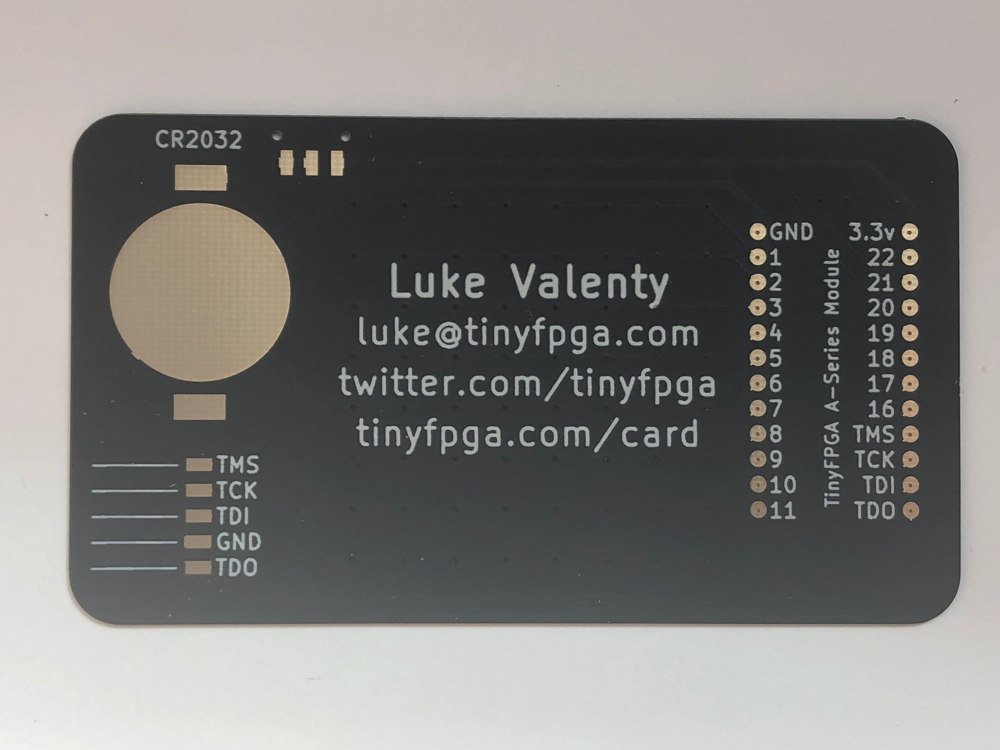
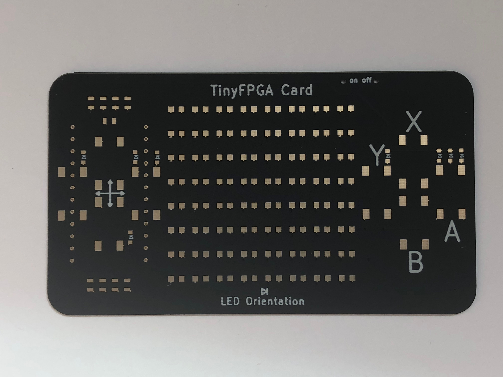

The TinyFPGA Card is my business card.  It's also an FPGA project board that can be assembled with an 8 x 8  array of LEDs, 8 buttons, a coin cell, and a TinyFPGA [A1](https://store.tinyfpga.com/products/tinyfpga-a1) or [A2](https://store.tinyfpga.com/products/tinyfpga-a2) board.  You can use an FTDI JTAG programmer or get a [TinyFPGA Programmer for $9](https://store.tinyfpga.com/collections/frontpage/products/tinyfpga-programmer).

### Front

### Back

### Components

All of the necessary components are located in the [TinyFPGA Card BOM](https://octopart.com/bom-tool/1BQzpLEW) on octopart.com.  They should all be in stock at Mouser.com as well.

### Assembly

The components are 0805 sized or larger.  They can all be soldered by hand, or you can use OSH Stencils (once I get back from Maker Faire and upload the project to GitHub).

### Programming the Board

If you haven't used the TinyFPGA A-series boards before, go through the [TinyFPGA A-series guide](http://tinyfpga.com/a-series-guide.html) to familiarize yourself with the software and development flow.

## More Updates to Come

This page will have a full build guide along with template projects and examples to try out when I get back from Maker Faire.
