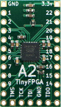

The TinyFPGA boards are a new series of low-cost, [open-source](https://github.com/tinyfpga) FPGA boards in a tiny form factor.  Solder on pins for use in a breadboard or PCB socket; or solder connectors, wires, and components directly onto the board.

## TinyFPGA Boards

|                       | TinyFPGA A1 | TinyFPGA A2 | TinyFPGA B2 |
|-----------------------|:-----------:|:-----------:|:-----------:|
|                       ||||
| FPGA Chip             |   XO2-256   |   XO2-1200  |  ICE40LP8K  |
| Programming Interface |     JTAG    |     JTAG    |     USB     | 
| Logic Cells           |     256     |     1200    |     7680    |
| Distributed RAM       |   2 KBits   |   10 KBit   |             |
| Block RAM             |             |   64 KBit   |   128 KBit  |
| User Flash            |             |   64 KBit   |  2000 KBit  |
| Phase Lock Loops      |             |      1      |      1      |
| User IO Pins          |     21      |     21      |     23      |
| Price                 |[$12](http://store.tinyfpga.com/product/tinyfpga-a1)|[$18](http://store.tinyfpga.com/product/tinyfpga-a2)|[$38](http://store.tinyfpga.com/product/tinyfpga-b2)|   

## Buy with Shipping from USA

## Buy with Shipping from Europe

## User Guides
The A- and B-Series boards use different FPGA families and their toolchains are different.  See the below guides to learn how to get started.

### [A-Series Guide](a-series-guide.html)

### [B-Series Guide](b-series-guide.html)

## FPGA Tutorials

I am developing a regular series of tutorials, articles, and hands-on labs utilizing the TinyFPGA boards.  They can be found on hackaday.io: [The Hobbyist's Guide to FPGAs](https://hackaday.io/project/27550-the-hobbyists-guide-to-fpgas).  If you are new to FPGAs and want to give them a try, this guide is for you.  If you haven't already, sign up for hackaday.io and follow the project to be notified when there are updates.

## TinyFPGA Discourse Community

A brand new Discourse server has been setup for TinyFPGA.  If you are interested in the TinyFPGA boards, join the [TinyFPGA Discourse](http://discourse.tinyfpga.com/) and ask away.  Luke is there often to help troubleshoot problems, answer questions, and post news.  Over time this will grow into the best place to meet other hobbyists, makers, and professionals interested in FPGAs and the TinyFPGA project.

## Digital Design Tools
### A-Series
The A-series boards use the [Lattice Diamond](http://www.latticesemi.com/latticediamond) design software for synthesizing digital designs into FPGA bitstreams.  It can be downloaded for free from [Lattice Semiconductor's website](http://www.latticesemi.com/latticediamond).  Follow their instructions carefully to get a free license file.

### B-Series
The B-series boards use the [Lattice iCEcube2](http://www.latticesemi.com/iCEcube2) design software for synthesizing digital designs into FPGA bitstreams.  It can also be downloaded for free from [Lattice Semiconductor's website](http://www.latticesemi.com/iCEcube2).  Just like Lattice Diamond, iCEcube2 requires a free license file to be downloaded so be sure to follow their directions carefully.

There is an opensource alternative available for the B-series boards called [Project IceStorm](http://www.clifford.at/icestorm/) however this has not yet been tested with the TinyFPGA boards.

To jumpstart development a simple [iCEcube2 project template](https://github.com/tinyfpga/TinyFPGA-B-series/tree/master/template) is provided with a top-level verilog file that represents the pins on the B-series boards.  This project contains a timing constraint for the 16MHz clock and pin constraints for each of the pins.  You can download the template as part of the [TinyFPGA B-Series Repository ZIP](https://github.com/tinyfpga/TinyFPGA-B-series/archive/master.zip).

## FPGA Programmer
### A-Series
The A-series boards are programmed via JTAG.  There is a dedicated [TinyFPGA Programmer](http://store.tinyfpga.com/product/tinyfpga-programmer) available to purchase.  It is the most cost-effective and convenient programmer for the A-series boards.  It can be used with the [TinyFPGA Programmer Application](https://github.com/tinyfpga/TinyFPGA-Programmer-Application/releases).

You can also use Lattice-compatible JTAG programmers [JTAG Programmer Hardware](https://www.ebay.com/sch/i.html?_productid=533163279) and the [Lattice Programmer Software](http://www.latticesemi.com/programmer).  

### B-Series
The B-series boards have a built-in USB bootloader.  To program a bitstream use the [TinyFPGA B-Series Programmer](https://github.com/tinyfpga/TinyFPGA-Programmer-Application/releases/) and select the serial port of the device and bitstream file.  If you are using Linux or OSX you can run the programmer application as a Python script.  It is available in the [TinyFPGA B-Series GitHub Repo](https://github.com/tinyfpga/TinyFPGA-B-Series/tree/master/programmer). You can download the programmer python scripts as part of the [TinyFPGA B-Series Repository ZIP](https://github.com/tinyfpga/TinyFPGA-B-Series/archive/master.zip).

