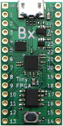

# TinyFPGA

The TinyFPGA boards are a new series of low-cost, [open-source](https://github.com/tinyfpga) FPGA boards in a tiny form factor.  Solder on pins for use in a breadboard or PCB socket; or solder connectors, wires, and components directly onto the board.

### TinyFPGA Boards

|                       | TinyFPGA A1 | TinyFPGA A2 | TinyFPGA B1 | TinyFPGA B2 |
|-----------------------|:-----------:|:-----------:|:-----------:|:-----------:|
|                       |||||
| FPGA Chip             |   XO2-256   |   XO2-1200  |  ICE40LP4K  |  ICE40LP8K  |
| Programming Interface |     JTAG    |     JTAG    |     USB     |     USB     | 
| Logic Cells           |     256     |     1200    |     3520    |     7680    |
| Distributed RAM       |   2 KBits   |   10 KBit   |             |             |
| Block RAM             |             |   64 KBit   |   80 KBit   |   128 KBit  |
| User Flash            |             |   64 KBit   |  2000 KBit  |  2000 KBit  |
| Phase Lock Loops      |      1      |      1      |      1      |      1      |
| User IO Pins          |     21      |     21      |     23      |     23      |
| Price                 |[$12.00](http://store.tinyfpga.com/product/tinyfpga-a1)|[$18.00](http://store.tinyfpga.com/product/tinyfpga-a2)|[$30.00](http://store.tinyfpga.com/product/tinyfpga-b1)|[$36.00](http://store.tinyfpga.com/product/tinyfpga-b2)|   

### Digital Design Tools
#### A-Series
The A-Series boards use the [Lattice Diamond](http://www.latticesemi.com/latticediamond) design software for synthesizing digital designs into FPGA bitstreams.  It can be downloaded for free from [Lattice Semiconductor's website](http://www.latticesemi.com/latticediamond).  Follow their instructions carefully to get a free license file.

#### B-Series
The B-Series boards use the [Lattice iCEcube2](http://www.latticesemi.com/iCEcube2) design software for synthesizing digital designs into FPGA bitstreams.  It can also be downloaded for free from [Lattice Semiconductor's website](http://www.latticesemi.com/iCEcube2).  Just like Lattice Diamond, iCEcube2 requires a free license file to be downloaded so be sure to follow their directions carefully.

There is an opensource alternative available for the B-Series boards called [Project IceStorm](http://www.clifford.at/icestorm/) however this has not yet been tested with the TinyFPGA boards.

To jumpstart development a simple [iCEcube2 project template](https://github.com/tinyfpga/TinyFPGA-B-Series/tree/master/template) is provided with a top-level verilog file that represents the pins on the B-Series boards.  This project contains a timing constraint for the 16MHz clock and pin constraints for each of the pins.  You can download the template as part of the [TinyFPGA B-Series Repository ZIP](https://github.com/tinyfpga/TinyFPGA-B-Series/archive/master.zip).

### FPGA Programmer
#### A-Series
The A-Series boards are programmed via JTAG.  You will need [JTAG Programmer Hardware](https://www.ebay.com/sch/i.html?_productid=533163279) and the [Lattice Programmer Software](http://www.latticesemi.com/programmer).  In the future there may be a dedicated programmer device for the A-Series boards.

#### B-Series
The B-Series boards have a built-in USB bootloader.  To program a bitstream use the [TinyFPGA B-Series Programmer](TinyFPGA_Programmer_1.0.exe) and select the serial port of the device and bitstream file.  If you are using Linux or OSX you can run the programmer application as a Python script.  It is available in the [TinyFPGA B-Series GitHub Repo](https://github.com/tinyfpga/TinyFPGA-B-Series/tree/master/programmer). You can download the programmer python scripts as part of the [TinyFPGA B-Series Repository ZIP](https://github.com/tinyfpga/TinyFPGA-B-Series/archive/master.zip).

